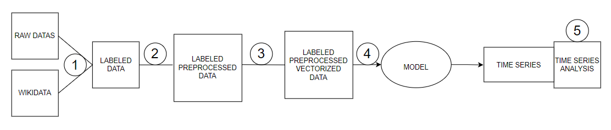

# ADA Quotebank Project - The AI Politologist

Mauro Leidi, Gioele Monopoli, Nicky Baldwin, Michael Roust

- Readme.md file containing the detailed project proposal (up to 1000 words). Your README.md should contain:

    - *Abstract: A 150 word description of the project idea and goals. What’s the motivation behind your project? What story would you like to tell, and why?*

    - *Research Questions: A list of research questions you would like to address during the project.*

    - *Proposed additional datasets (if any): List the additional dataset(s) you want to use (if any), and some ideas on how you expect to get, manage, process, and enrich it/them. Show us that you’ve read the docs and some examples, and that you have a clear idea on what to expect. Discuss data size and format if relevant. It is your responsibility to check that what you propose is feasible.*

    - *Proposed timeline Organization within the team: A list of internal milestones up until project Milestone 3.
    Questions for TAs (optional): Add here any questions you have for us related to the proposed project.*

- Notebook containing initial analyses and data handling pipelines. We will grade the correctness, quality of code, and quality of textual descriptions.

# Abstract
In this project Quotebank is used to analyze American politics in depth. It is necessary to label the quotes with their political inclination.
Subsequently, a model is trained to predict the quote political inclination. Thanks to the value predicted by the model, it is possible to analyze how polarized the prediction is, and therefore discover how much the quote is representative of the political vision of the political party itself.
Using this model, quotes of one politician can be summarized in a time series of political scores. These time series can be used in various ways to extract meaningful insights about American politics. We will study the trend of the political position of a selected politician and how influential a politician is within his political group. The goal is to allow users to make these customized and fast analysis. We will focus on the classification between Republicans and Democrats.

# Research Questions
The main questions we want to answer are:
- How does a politician's political vision evolve over time?
- How much is a politician influenced by the statements of another politician?
- How influential is a politician within a political group?
One of the advantages of our approach is that it is not specific to the questions posed above, therefore once the model is created it is easy to be able to answer other different questions as well. For example, we would be able to see which party members have more distant positions or which members of different parties have a higher negative correlation.
# Proposed timeline Organization within the team
A summary of the workflow we have imagined is presented in the following image:

1) Merging Quotebank with wikidatas, keeping only the data where the occupation is related to politics.
2) Preprocess data for the moment we are doing:
   1) Replace not assigned values with empty spaces
   2) Lowercase all text
   3) Remove all blocks of digits
   4) Remove all string.punctuation (!"#$%&'()*+,-./:;<=>?@[]^_`{|}~)
   5) Remove all accents from strings
   6) Remove all stop words
   7) Remove all white space between words.
3) Vectorization of the data, for the moment we are representing data with the TF-IDF model. We encountered some RAM problems, but we found many solutions online thanks to algorithms that do not requirer the full dataset load in memory but works with chunks of data.
4) Model creation: We need to create a model for classification. We have in mind two main approaches: 1. Training a model from scratch with our data. 3. Using NLP pretrained models and fine tuning for our purpose (we still need to study if this is feasible).
5) Graphic User Interface creation and presentation of results.
6) Time series statistical analysis.
The internal time schedule is presented in the following table:

Task                    | Date         |Responsable
------------------------| -------------|-------------
Merge Wikidata Quotebank| Done         |     /
Preprocess text data    | Done         |     /
text data Vectorization | Done         |     /
Model creation          | by 03.12.2021| Nicky  & Mauro
GUI + interactive setup | by 07.12.2021| Gioele with the help of Michael  & Mauro
Time series analyisis   | by 11.12.2021| Nicky & Michael

# Additional stuff
In order to deal with such a big dataset we are rewriting our datasets in pickle format. This allow for fast reading and writing. In addition, as suggested, when is necessary we always process data either line-by-line either in chunks. We encountered a RAM overload problem when tring to vectorize the data with tf-idf model, but managed to solve them thanks to algorithms that allows iterable as inputs, and do not load all data into memory.
Everything we have done is absolutely not to be seen as a definitive choice, but rather as a first exploration to see what results we can try to achieve. In this case, keeping other data from the wikidata such as sex or other characteristics of the speaker could greatly improve our performances. To get a first idea of the difficulty of the task we faced, we have visualized the PCA of NB datapoints.

As we can see the data does not appear linearly separable with such a simple method. As a second test we tried to predict the class thanks to a simple sklearn random forest classifier, the result is quite comforting, giving a cross-validation precision just under 70%.
# Questions for TAs
The first question we ask ourselves is whether it is worth trying to identify apolitical messages as a supplementary class. For example we thought that if a politician, Democrat or Republican, makes a statement about sport it should not be classified as politics by our model. In this direction, the statements of some groups of people (such as sportspeople) could be classified as apolitical. However, this task remains difficult to do cleanly (a politician might be politically engaged) and we'd love to have some advice on it. Another solution to reduce the impact of this problem would be to look inside the urls for a substring that represent a topic not related to politics. For example if we find the word "gossip" in the url the quotation will not probably be a political statement. Therefore we can discard this quotation that would only bias our model. We repete this operation on multiple misleading keywords. Is this a good idea?
# Code organization

### Notebooks
- [raw_data_exploration.ipynb](raw_data_exploration.ipynb): Notebook containing surface analyses on the complete raw Quotebank dataset.
- [final_data_exploration.ipynb](final_data_exploration.ipynb): Notebook containing all the in depth analyses of the data. Analyses are ran on (at times samples of) raw and cleaned 2020 datas as performing them on the full dataset would be largely impractical and provide little added benefit.

### Scripts and project wide utilities
- [helpers.py](helpers.py): Project wide constants, file paths, helper and utility functions.
- [prepro_pipeline.py](prepro_pipeline.py): Executable that perfoms the 1st part of our data preprocessing pipeline. Currently performs the following operations:
  - Labels quotes by the political party (Republican or Democrat) of the speaker attributed to each quote. Using functions from [prepro_party_labeling.py](prepro_party_labeling.py)
  - Drops unused columns to reduce dataset footprint.
  - Cleans quotation text. Performs procedures such as lowercasing all characters, removing diacritics and more. See detailed description in
- [prepro_party_labeling.py](prepro_party_labeling.py): Labels data by merging Quotebank quotes data to the Wikidata speaker_attributes dump. Any quotes that have no speaker attributed to them or have a speaker that is neither Republican or Democrat are dropped.
- [prepro_pipeline2.py](prepro_pipeline2.py)
- [prepro_pipeline2.py](prepro_pipeline2.py)

